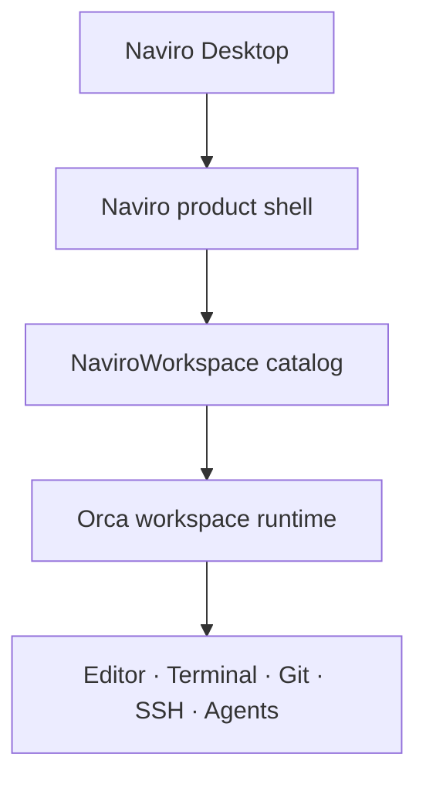

# Naviro

> An AI Work OS for bringing projects, files, knowledge, tasks, terminals, Git, and AI agents into one coherent workspace.

Naviro is being built as a unified work environment where people can organize work, understand context, and collaborate with AI without switching between disconnected tools.

This repository contains **Naviro Desktop**, the first Naviro application. It is a controlled fork of [stablyai/orca](https://github.com/stablyai/orca) and keeps Orca's editor, terminal, Git, worktree, SSH, and agent runtime while adding a Naviro-owned product shell and workspace model.

Naviro is not a finished V1 product yet. The current milestone is a validated technical foundation for the wider Desktop + Server + Mobile vision.

## Project status

The current milestone is **M1 — Naviro Workbench**. Phase 0–2 have been implemented and validated in CI, and the project is at its mandatory review gate.

| Phase | Scope | Status |
| --- | --- | --- |
| 0 — Orca Baseline | Reproducible upstream baseline, toolchain, build process, and fork strategy | Implemented and CI validated |
| 1 — Naviro Desktop Shell | Naviro identity, navigation, and bridge to existing Orca capabilities | Implemented and CI validated |
| 2 — Multi-root Workspace | One logical workspace containing multiple independent folders and repositories | Implemented and CI validated |
| 3+ | Server, application backends, AI Gateway, orchestration, connectors, memory, remote workers, and mobile | Planned, not implemented |

Development intentionally stops after Phase 2 until the milestone is reviewed and the next scope is explicitly approved.

## What works today

### Existing runtime foundation

Naviro Desktop preserves the mature capabilities inherited from Orca:

- code editing and file operations;
- integrated terminals;
- Git, diffs, branches, and worktrees;
- local, WSL, and SSH execution paths;
- coding-agent sessions and tools;
- desktop support for Windows, macOS, and Linux.

### Naviro M1 additions

- Naviro desktop title, product shell, and work-oriented navigation;
- Home, Assistant, Inbox, Tasks, Notes, Projects, Automations, Agents, Files, Git, and Terminal entry points;
- named logical workspaces that persist across restarts;
- multiple unrelated local folder and Git roots in one workspace;
- imported remote-root metadata can retain existing Orca runtime bindings;
- stable workspace and root identities that do not depend on file paths;
- independent top-level roots in Explorer;
- root-aware search results;
- terminal startup in the selected writable root;
- Source Control activation for one selected Git root at a time;
- read-only roots that cannot open mutating terminals;
- portable, versioned `.naviro-workspace` documents;
- safe handling of duplicate, missing, unbound, Windows, and POSIX paths.

The M1 navigation entries for future application domains are intentionally shell surfaces only. Tasks, notes, inbox, assistant, automation, and other server-backed product features are not presented as complete backends.

## Architecture

Naviro M1 adds a product layer above Orca instead of replacing its workspace runtime.



A `NaviroWorkspace` aggregates logical roots and binds each one to an existing Orca folder, repository, worktree, or execution context when available. It does not turn Orca's single-root `FolderWorkspace` path into a global array and does not take ownership of user files.

Each root retains its own:

- stable ID and user-defined alias;
- native path and root type;
- read-only or read-write access policy;
- Git boundary;
- execution host and optional Orca runtime binding.

The central rule is:

```text
context root != Git root != write root
```

Adding, renaming, or removing a logical root never moves, copies, renames, or deletes the underlying project directory.

No Naviro Server is required by M1. The desktop application continues to use the existing local and remote execution boundaries provided by Orca.

## Product direction

Naviro's long-term architecture extends beyond this desktop repository:

- **Naviro Desktop** — the primary workspace and deep local development environment;
- **Naviro Server** — shared state, assistant services, projects, tasks, notes, automation, memory, and remote coordination;
- **Naviro Mobile** — a companion application that connects directly to Naviro Server and does not require Naviro Desktop to remain online;
- **Web access and remote workers** — later clients and execution capacity coordinated through the server.

Planned milestones:

| Milestone | Direction |
| --- | --- |
| M1 — Naviro Workbench | Desktop shell and multi-root workspace |
| M2 — Naviro Core Services | Server-backed assistant, tasks, projects, and notes |
| M3 — AI Platform | Provider-neutral AI Gateway and agent orchestration |
| M4 — Connected Work OS | Automations, connectors, durable memory, remote workers, and mobile |
| M5 — V1 | Security hardening, productization, release candidate, and public release |

These future milestones are planning context, not functionality currently available in this repository.

## Repository and upstream strategy

```text
origin   https://github.com/TuanTAg/naviro-desktop.git
upstream https://github.com/stablyai/orca.git
baseline 063b8042988bd4c7df1f7acf08949b36be082e04
```

Naviro changes are kept in isolated modules wherever possible:

- renderer-owned features: `src/renderer/src/naviro/`;
- shared workspace contracts: `src/shared/naviro-*`;
- direct changes to upstream-owned code: recorded in [`docs/naviro/UPSTREAM_PATCHES.md`](docs/naviro/UPSTREAM_PATCHES.md).

This structure is intended to keep future synchronization with Orca reviewable while preserving folder workspaces, Git worktrees, SSH, remote-wire compatibility, and cross-platform behavior.

## Development

### Prerequisites

- Node.js 24;
- pnpm 10.24.0 through Corepack;
- Git;
- Python 3 and the platform's native C/C++ build tools.

### Setup and validation

```bash
git clone https://github.com/TuanTAg/naviro-desktop.git
cd naviro-desktop
git remote add upstream https://github.com/stablyai/orca.git
corepack enable
corepack prepare pnpm@10.24.0 --activate
pnpm install --frozen-lockfile

pnpm dev
pnpm lint
pnpm typecheck
pnpm test
pnpm build
```

Platform packaging:

```bash
pnpm build:win
pnpm build:mac
pnpm build:linux
```

See [`docs/naviro/BUILDING.md`](docs/naviro/BUILDING.md) for native prerequisites, focused Naviro tests, Electron E2E commands, and CI evidence.

## Current packaging note

M1 preserves upstream package, executable, protocol, environment-variable, helper, and update-channel identities for compatibility. The current Windows installer is therefore unsigned and may still use the Orca executable/package name. Complete package identity, code signing, release channels, icons, and public distribution are deferred to productization.

## Project documentation

- [Current execution scope](docs/naviro/CURRENT_SCOPE.md)
- [Roadmap](docs/naviro/ROADMAP.md)
- [Architecture](docs/naviro/ARCHITECTURE.md)
- [Build and validation](docs/naviro/BUILDING.md)
- [Definition of Done](docs/naviro/DEFINITION_OF_DONE.md)
- [Implementation status](docs/naviro/STATUS.md)
- [Upstream strategy](docs/naviro/UPSTREAM_STRATEGY.md)
- [Upstream patch ledger](docs/naviro/UPSTREAM_PATCHES.md)

## Non-negotiable principles

1. Preserve upstream compatibility and proven Orca runtime behavior.
2. Keep Naviro-owned product logic isolated from upstream core wherever possible.
3. Keep context root, Git root, and write root distinct.
4. Preserve folder workspaces, Git worktrees, SSH, remote-wire compatibility, and native platform paths.
5. Never move or copy user project folders when managing logical roots.
6. Do not represent planned backends as implemented features.
7. Stop at the explicitly authorized phase boundary.

## Attribution and license

Naviro Desktop builds on Orca and retains its upstream history and license obligations. See [LICENSE](LICENSE).
